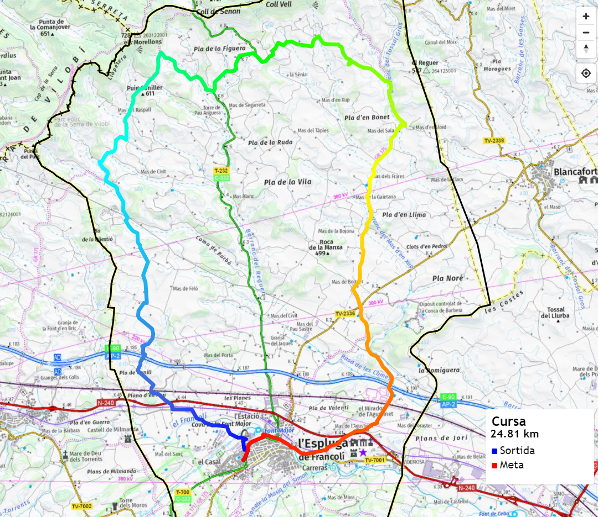

# Race Locator

> Node/Express/Mongo/EJS//Mapbox app for the Espluga de francolí race. Contains the route of the race and the administrative limits of the municipality.
[https://www.geoatles.com/](https://www.geoatles.com/)

## Quick Start


```bash
# Install dependencies
npm install

# Serve on localhost:5500
npm run dev (nodemon)
or
npm start

```

## Map with the route

